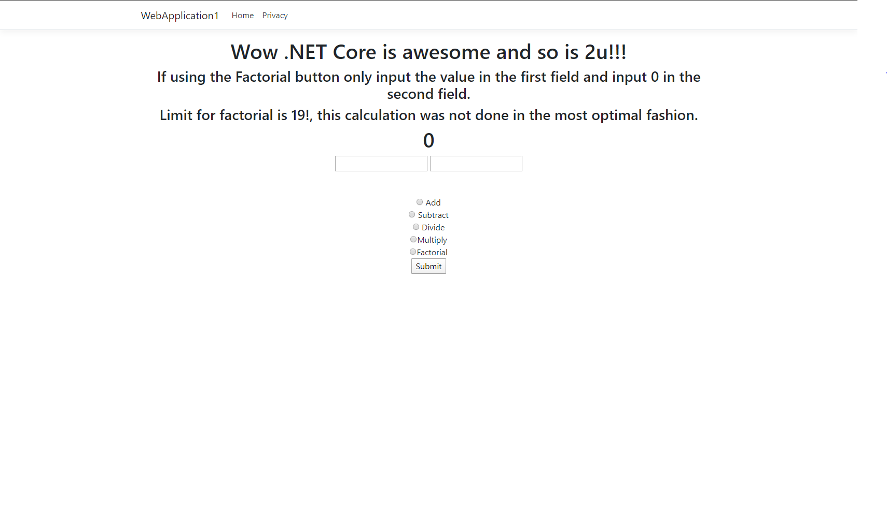

### This activity is meant to introduce you to web application's in .NET.
The objective of this execrise is not to get an expert level understanding of ASP.NET web apps , but rather to highlight how quickly and with ease
one can get a website up with ASP.NET. In further sections we will divide more into the roots behind this framework.


In the Unsolved file the application that the instructor started on is provided. Add a method the following methods to the MathOperations class that preforms a preform divide,multiply, and factorial.
calculation.

# **Use:**
 
The factorial method is located inside the SpecialFunctions class. Feel use it directly in the MathOperations class since factorial is a static method or implement it inside that class manually.

```c# 
  public static int Factorial(int n)
        {
            int _retval = 1;
            while (n != 1)
            {
                _retval = _retval * n;
                n = n - 1;
            }
            return _retval;

        }
```
  
  
  Make sure that your webpage closely reseambles the image below.
  
  
---
  **Take home:**
  Despite this being a bit of a challenging assignment, look how far you have come in this lecture. Even if the functionality was not perfectly 
  implemented consider how much longer it would have taken to make a web page of this nature using plain javascript, html, and css. This is the power
  of using .NET for projects. 
